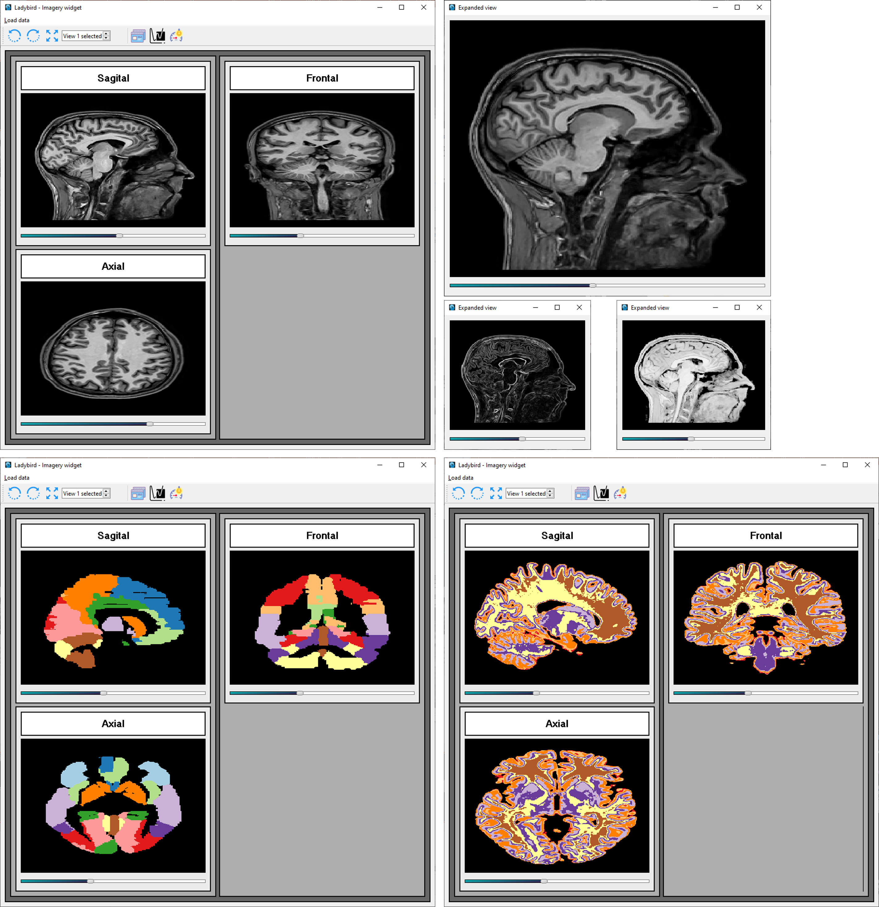

# Halyzia© / Ladybird MRI & Medical Scanner Viewer

## 📄 Description
Halyzia©, also known as Ladybird, is a sophisticated software designed for the automatic detection of fast-ripples (FRs) in epilepsy, as described in the [doctoral thesis of L. Gardy](http://thesesups.ups-tlse.fr/5164/1/2021TOU30190.pdf) and patented under [Brevet: FR3128111](https://data.inpi.fr/brevets/FR3128111). This repository showcases a component of Halyzia© that is focused on the visualization and manipulation of 3D medical images such as MRI and PET scans. This component is designed to function independently of the complete software suite, providing standalone capabilities for medical image navigation and analysis.

The MRI viewer included in this repository provides robust tools for navigating and interacting with 3D medical images. It supports a wide range of common image formats, including NIfTI (compressed `.nii.gz` and uncompressed `.nii`) and DICOM. Users can load both clinical and research images, with several atlases accessible from the shared database. Key functionalities include zooming in on specific anatomical planes, rotating images, and applying various image processing filters. This tool is designed to facilitate detailed analysis and enhance the visualization of medical imaging data.

⚠️ Please note that this MRI viewer is still under development and has not been validated by any regulatory authority. It was developed as part of research projects and is intended as a side project with no major pretensions.

## ⚒️ Installation

### Prerequisites
- Python 3.11
- Python libraries
    ```sh
    pip install -r requiremetns_local.txt  # for PyQt6 GUI, and/or,
    pip install -r requiremetns_web.txt  # for Web GUI
    ```

## 📝 Usage

### Local version (PyQt GUI)

#### Running the application
To launch the MRI viewer, you can either execute the `main.py` script from the terminal or double-click the `main.bat` file to open the GUI automatically.

```sh
python main_local.py  # Launches the local GUI
```



### <span style="color:red">Update!</span> The app is now available on a Web GUI
The local version of the MRI viewer has been adapted for web deployment using Streamlit. This web version offers comparable functionalities as the local version, with a user-friendly interface accessible from any web browser. To run the web version, execute the `main_web.py` script and open the provided URL in your browser.
The web version of the MRI viewer is designed to be accessible and easy to use, with a streamlined interface that simplifies the process of loading and viewing medical images. While the local version offers more advanced features and capabilities, the web version provides a convenient alternative for users who prefer a browser-based interface.

```sh
streamlit run main_web.py  # Launches the web GUI
```


**Public URL:** coming soon.

## 📚 References
- MRI atlases: https://www.nitrc.org/projects/mricron
- Toolbar icones: https://icons8.com/

## 👤 Author
- LinkedIn: [Ludovic Gardy](https://www.linkedin.com/in/ludovic-gardy/)
- Doctoral thesis: [PDF](http://thesesups.ups-tlse.fr/5164/1/2021TOU30190.pdf)